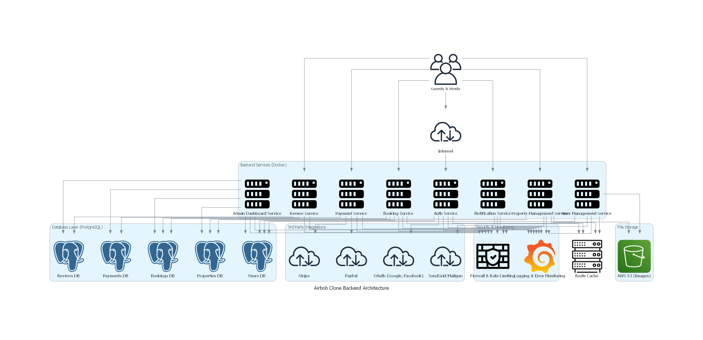

Here is the suggested content for your `README.md` file:

---

# **Features and Functionalities Documentation**

This document provides an overview of the key features and functionalities required for the backend of the Airbnb Clone project. The attached diagram visually represents the system's core components, interactions, and processes, ensuring a scalable, secure, and user-friendly application.

---

## **Key Features**

### 1. **User Management**
- **User Registration**: Guests and hosts can sign up using email and password or via OAuth providers (e.g., Google, Facebook).
- **Authentication**: Secure login using JSON Web Tokens (JWT).
- **Profile Management**: Users can update profile details, including photos, contact information, and preferences.

### 2. **Property Listings Management**
- **Add Listings**: Hosts can create property listings with details like title, description, location, price, amenities, and availability.
- **Edit/Delete Listings**: Hosts can modify or remove property listings as needed.

### 3. **Search and Filtering**
- **Search Functionality**: Users can search properties by:
  - Location
  - Price range
  - Number of guests
  - Amenities (e.g., Wi-Fi, pool, pet-friendly)
- **Pagination**: Ensure efficient handling of large datasets.

### 4. **Booking System**
- **Create Bookings**: Guests can book properties for specific dates, with date validation to prevent double bookings.
- **Manage Bookings**: View booking statuses (pending, confirmed, completed, canceled).
- **Cancellation**: Support cancellation requests based on policies.

### 5. **Payment Integration**
- **Payment Processing**: Securely handle payments using gateways like Stripe or PayPal.
- **Host Payouts**: Automate payouts to hosts after booking completion.
- **Multi-Currency Support**: Enable transactions in various currencies.

### 6. **Reviews and Ratings**
- **Guest Reviews**: Guests can leave reviews and ratings for properties.
- **Host Responses**: Hosts can reply to reviews.
- **Validation**: Reviews must be linked to completed bookings.

### 7. **Notification System**
- **Email Notifications**: For booking confirmations, cancellations, and payment updates.
- **In-App Notifications**: Real-time updates for users.

### 8. **Admin Dashboard**
- **User Management**: View, edit, or deactivate user accounts.
- **Listing Management**: Monitor and manage property listings.
- **Booking Management**: Oversee and manage bookings.
- **Payment Monitoring**: Track and resolve payment issues.

---

## **Technical Requirements**
- **Database**: PostgreSQL or MySQL for relational data storage.
- **Authentication**: Secure user sessions using JWT.
- **File Storage**: Cloud-based storage for images (e.g., AWS S3 or Cloudinary).
- **API**: RESTful API design with standard HTTP methods and status codes.

---

## **Diagram**
The diagram below illustrates the backend architecture and flow of features and functionalities:

This documentation provides a comprehensive guide to the backend system's design, ensuring clarity and alignment with project objectives.
