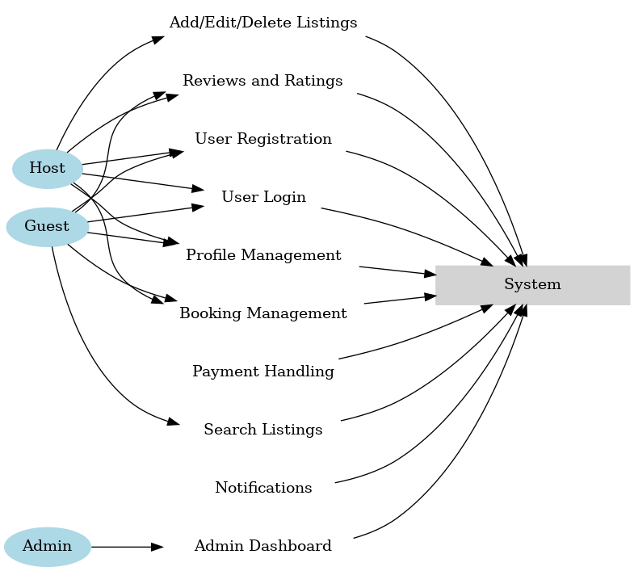

### Steps to Design the Use Case Diagram for Airbnb Clone Features

---

#### **1. Understand the System Requirements**
- Identify key **actors** in the system:
  - **Guest**: User looking to book properties.
  - **Host**: User listing properties for rent.
  - **Admin**: User managing the system.
- Identify key **use cases**:
  - **User Management**: Registration, login, profile updates.
  - **Property Listings**: Add, edit, delete listings.
  - **Booking System**: Search, book properties, manage bookings.
  - **Payment System**: Process payments, manage payouts.
  - **Notifications**: Send confirmations and updates.
  - **Admin Functions**: Monitor and manage users, listings, bookings.

---

#### **2. Design the Use Case Diagram**
- Open [Draw.io](https://app.diagrams.net/).
- Create a **use case diagram**:
  - Add **actors** (stick figures) representing **Guest**, **Host**, and **Admin**.
  - Add **ellipses** for each use case representing functionalities (e.g., "Register User", "Search Properties").
  - Connect actors to their respective use cases using straight lines.
  - Group related functionalities for clarity:
    - **Guest**: Register, Login, Search Properties, Book Property, Write Review.
    - **Host**: Manage Listings, View Booking Requests, Receive Payments.
    - **Admin**: Manage Users, Listings, Bookings, and Payments.

---

#### **3. Export the Diagram**
- Export the diagram as a **PNG** file:
  - File name: `use-case-diagram.png`.

---

#### **4. Prepare the GitHub Repository**
- **Repository**: Clone or create the `alx-airbnb-project-documentation` repository locally.
  ```bash
  git clone https://github.com/your-username/alx-airbnb-project-documentation.git
  cd alx-airbnb-project-documentation
  ```
- **Directory Structure**: Create the `use-case-diagram` directory.
  ```bash
  mkdir -p use-case-diagram
  ```
- Move the PNG file to this directory:
  ```bash
  mv /path/to/use-case-diagram.png use-case-diagram/
  ```

---

#### **5. Add a `README.md`**
- Create a `README.md` file in the `use-case-diagram/` directory.
  ```bash
  nano use-case-diagram/README.md
  ```
- Add a description of the use case diagram:
  ```markdown
  # Use Case Diagram

  This document provides a visualization of the interactions between users and the Airbnb Clone system. The diagram outlines the primary actors (Guest, Host, and Admin) and the functionalities they can perform.

  ## **Key Actors**
  - **Guest**: A user who books properties.
  - **Host**: A user who lists properties for rent.
  - **Admin**: A user who manages the platform.

  ## **Use Cases**
  ### For Guests:
  - Register and Login
  - Search for Properties
  - Book Properties
  - Write Reviews

  ### For Hosts:
  - Add, Edit, and Delete Listings
  - Manage Booking Requests
  - Receive Payments

  ### For Admins:
  - Monitor Users, Listings, and Bookings
  - Manage Payments

  ## **Diagram**
  The use case diagram below visualizes the system's interactions:

  
  ```
